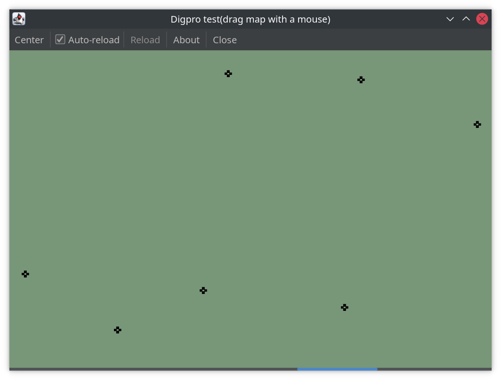

## Build instructions

I used java 19, but java 17 should work as well

```bash
git clone https://github.com/lazystone/digpro.git
cd digpro
./gradlew clean build

# Run application
java -jar build/libs/digpro-0.0.1-SNAPSHOT.jar
```

## Notes

* You can use mouse to move over the map(drag&drop it).
* There is not any tests but there isn't much business logic either.
* Method which is used to filter out visible locations is simple, for bigger datasets something like `kd-trees` should be used.
* Things like locations URL and auto-reload frequency should be moved to application properties rather than to be hard-coded, but I'm out of time now.
* ViewPort coordinates are stored as fields in MapCanvas, but more correct way is to send them as parameters
  from `mouseDragged` to `refresh` method to avoid possible inconsistency(again out of time to fix this).

* To generate reachability metadata(for a native build): `java -agentlib:native-image-agent=config-output-dir=src/main/resources/META-INF/native-image -jar build/libs/digpro-0.0.1-SNAPSHOT.jar`
